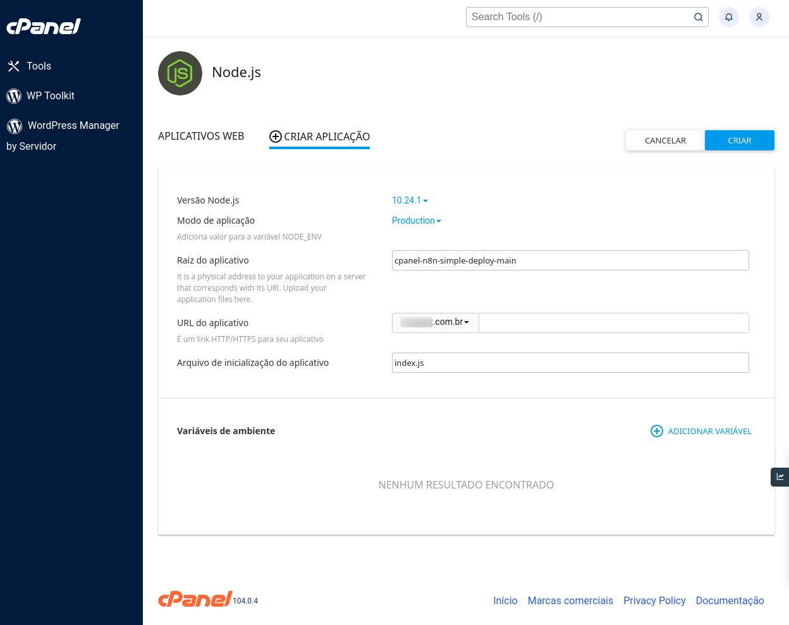

Cpanel n8n simple deploy
=========================================

This script lets you to run n8n in cpanel hosts easy.

## Testing in localhost:

Install:

```
npm run install-n8n
```

Start:

```
npm run start
```

You can add more commands in your `package.json`

## Installing in a cpanel server

Copy zip file or do a git clone in your home folder and set this:


